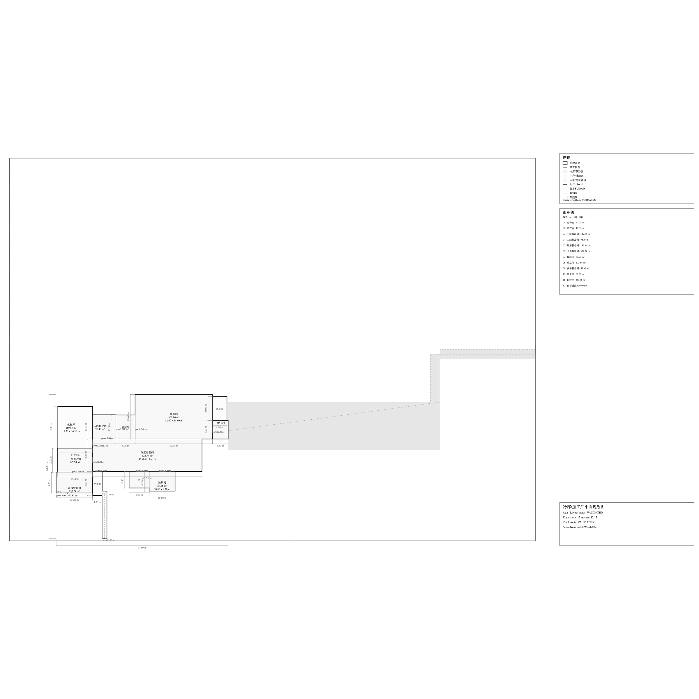
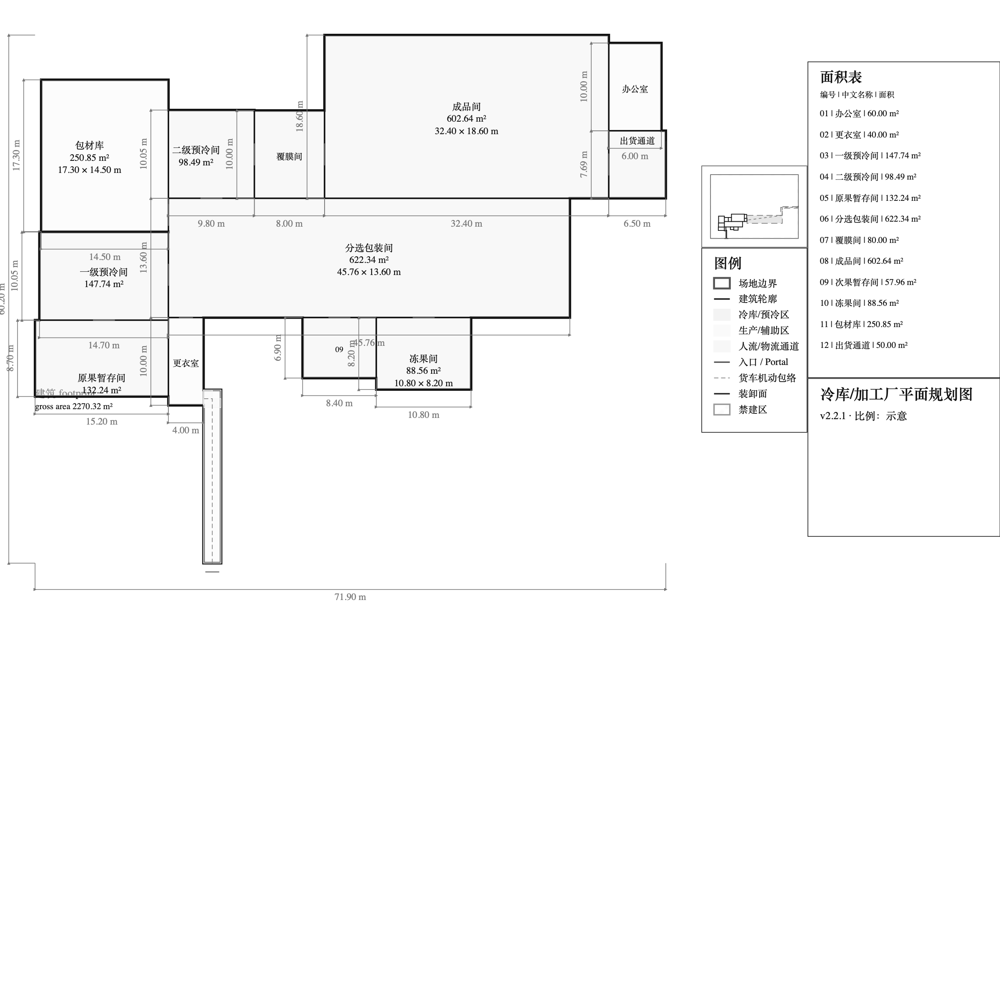

# V2.2.1 P1E — Engineering Sheet Composition

```ini
TASK_ID=V2_2_1_P1E_ENGINEERING_SHEET_COMPOSITION_R1
BASE_MAIN_SHA=2154c869ed202beeeb1903d1875508122a4ed829
TARGET_VERSION=v2.2.1
ACTIVE_GOVERNANCE_LANE=V2.2.1_P1E
P1E_AUTHORIZED=true
COMPOSITION_IDENTITY=engineering-sheet-composition@1.0.0
COMPOSITION_CANDIDATES=RIGHT_RAIL|BOTTOM_RAIL
COMPOSITION_CANDIDATE_ORDER=RIGHT_RAIL_THEN_BOTTOM_RAIL
ENGINEERING_SHEET_PRIMARY_PLAN_FOCUS=true
ENGINEERING_SHEET_CONTEXT_INSET_VISIBLE=true
FULL_SITE_CONTEXT_PRESERVED=true
ENGINEERING_SHEET_FULL_ROOM_DIMENSIONS=true
PRESENTATION_SVG_BYTES_CHANGED=false
MOBILE_PREVIEW_SVG_BYTES_CHANGED=false
ENGINEERING_REVIEW_SVG_BYTES_CHANGED=false
ENGINEERING_SHEET_SVG_BYTES_CHANGED=true
MAIN_DRAWING_OCCUPANCY_MIN=0.70
MAIN_DRAWING_OCCUPANCY_TARGET=0.78
MAIN_DRAWING_OCCUPANCY_MAX=0.88
P1D_DRAWING_LINT_GATE=HARD_GATE
SOURCE_ENGINEERING_GEOMETRY_CHANGED=false
ENGINEERING_COORDINATES_MUTATED=false
P2_CHANGED=false
P2D_CHANGED=false
P4_CHANGED=false
MCP_CHANGED=false
DATABASE_CHANGED=false
FRONTEND_CHANGED=false
READY_AUTHORIZED=false
MERGE_AUTHORIZED=false
TAG_AUTHORIZED=false
RELEASE_AUTHORIZED=false
DEPLOYMENT_AUTHORIZED=false
NO_STEP_IMPLIES_THE_NEXT=true
```

## Decision

Only the `ENGINEERING_SHEET` page composition changes. The main viewport is
derived from the existing primary building plan bounds (building footprint,
the twelve authoritative zones, and the established drawing margin). The
complete site remains visible in a separate context inset with its site and
buildable boundaries, obstacles/no-build geometry, building, entrances,
loading interface, and supplied truck/site circulation. The inset is a
projection of existing facts, not a second geometry authority.

The finite candidate order is `RIGHT_RAIL`, then `BOTTOM_RAIL`. Each candidate
is rendered from the same source facts and is eligible only if the existing
`drawing-lint@1.0.0` report passes with zero errors, zero warnings, and zero
unavailable required facts, and if the frozen occupancy and context/dimension
requirements pass. Candidate selection is deterministic; it introduces no
new engineering score or placement objective. The representative input
selects `RIGHT_RAIL`.

The representative `ENGINEERING_SHEET` measures main-drawing occupancy
`0.7008771929824561`, primary-plan screen occupancy `0.7943176771550949`,
primary-plan width ratio `0.8998748435544431`, and height ratio
`0.8826979472140762`. These primary-plan ratios use the actual primary bounds
inside the drawing bounds; they are not inferred from the drawing rectangle
itself. The selected composition satisfies the minimum main-drawing occupancy
of `0.70`; the `0.78` value remains the target, not a substitute for the
explicit minimum. The `BOTTOM_RAIL` candidate does not meet the minimum for
this fixture and is therefore rejected. All dimensions remain visible.

Engineering overlays remain visible, but sheet-only business drawing
visibility is separated from `ENGINEERING_REVIEW` provenance/debug visibility.
The sheet hides internal zone codes, source hashes, portal debug text, schema
identity, and raw validation status while retaining engineering geometry and
dimensions. `ENGINEERING_REVIEW` retains its prior debug policy.

## Evidence and boundaries

For the representative 20 t/day full-pass fixture:

| Measure | Before | P1E result |
| --- | ---: | ---: |
| Primary-plan screen occupancy | 0.1422613826 | 0.7943176771550949 |
| Primary-plan width ratio | 0.3504385965 | 0.8998748435544431 |
| Primary-plan height ratio | 0.4059523810 | 0.8826979472140762 |
| Main-drawing occupancy | 0.7799991789 | 0.7008771929824561 |
| Drawing lint warnings | 4 | 0 |

The four original warnings are resolved by focusing the main view on the
building plan, preserving the full site in its inset, and keeping review-only
metadata out of the sheet. The composition does not suppress diagnostics or
weaken their severity.

The baseline SVG SHA-256 values for `PRESENTATION`, `MOBILE_PREVIEW`, and
`ENGINEERING_REVIEW` remain respectively:

```ini
PRESENTATION=sha256:97e7c9083050dc1e1edd01c8880f4c7aa1d2526d72e8eff809ee792bda8cf59e
MOBILE_PREVIEW=sha256:db6a39e7ad38ca8c0b0fc2063d4189bdd295691d92aaf7a922e59d7c200954c8
ENGINEERING_REVIEW=sha256:48ea97310b955b3e5b94ea68eebed49c377031c74cb4eeba9db003e36042f37d
```

The `ENGINEERING_SHEET` SVG changes as intended. Its representative output
hash is `sha256:96c82d7296d027a9b41b4b2d8198e7239bed61dbc0811259e0575e2ca3eb25d3`.
The structured validated layout, zone/site/building/access/truck geometry,
loading face, and engineering coordinates are not modified. No equipment,
racks, grid, columns, doors, or vehicle geometry is inferred.

This implementation is a projection/page-space correction only. It does not
change zone dimensioning or area authority, placement, candidate ranking,
routing, truck validation, P2/P2D/P4, MCP, persistence, frontend, or
calculations. Owner visual review remains a separate acceptance gate. No
subsequent phase, Ready/Merge, tag, release, or deployment is authorized here.

## Representative visual evidence

Both images use the same unmodified representative 20 t/day full-pass
fixture. They are direct 2400×2400 PNG renders of the baseline and P1E SVG;
no crop or post-processing was applied. The P1E composition output is
`RIGHT_RAIL`, and the source geometry is identical.

| Artifact | SHA-256 |
| --- | --- |
| Before Engineering Sheet SVG | `9383f8686189ab9152f1203a9c4af20d85545293e46952f25ed7af13bfac3237` |
| After Engineering Sheet SVG | `96c82d7296d027a9b41b4b2d8198e7239bed61dbc0811259e0575e2ca3eb25d3` |
| Before PNG | `478b1435aafbf0b291246944a8b583d1b7da82a3498bdf4fe89cd40807bfbbd3` |
| After PNG | `a66694075558789f8652bc4b52a2ad1389a68f7300897f30dadc3feec126d5ec` |

### Before P1E



### After P1E


