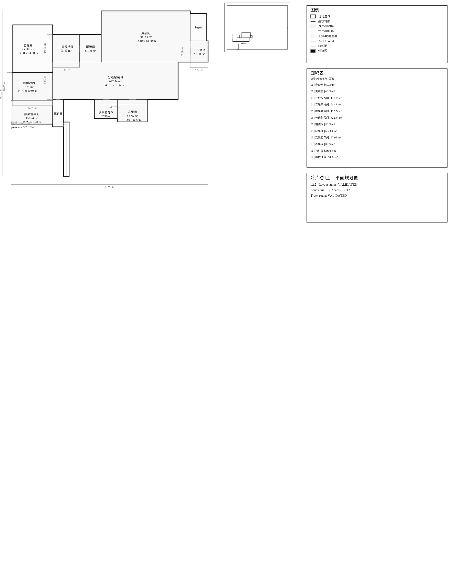
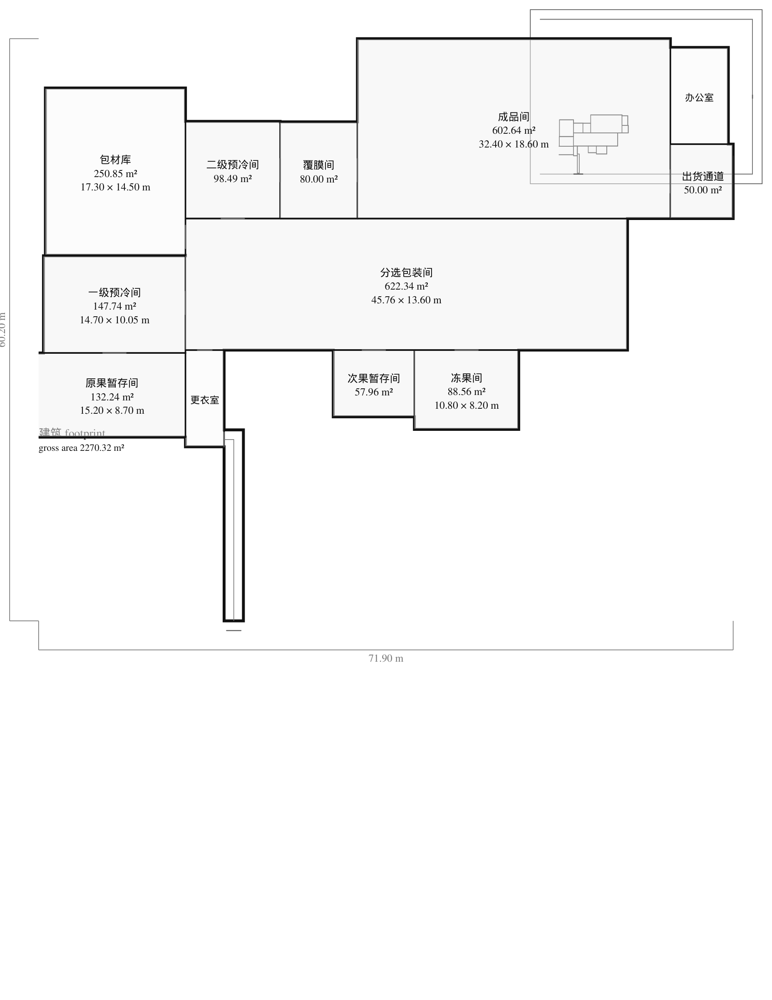
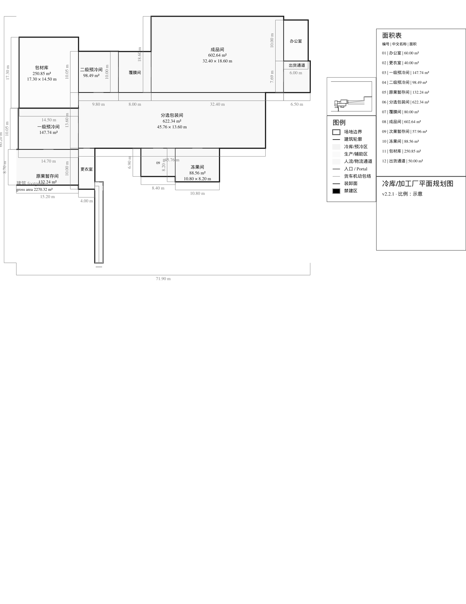
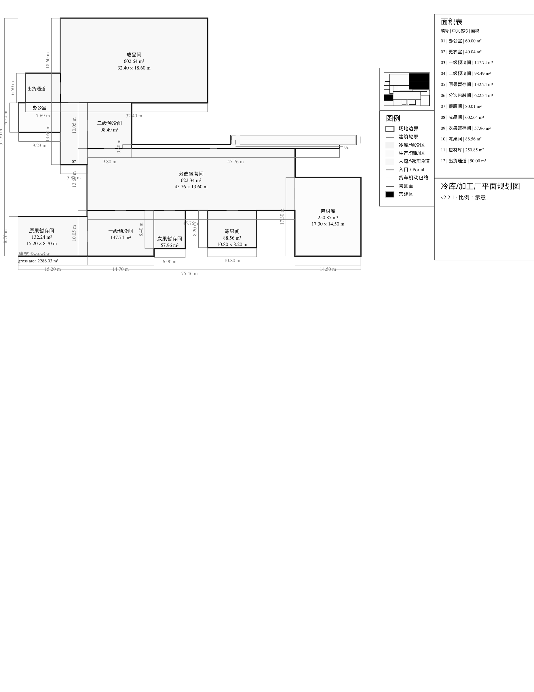
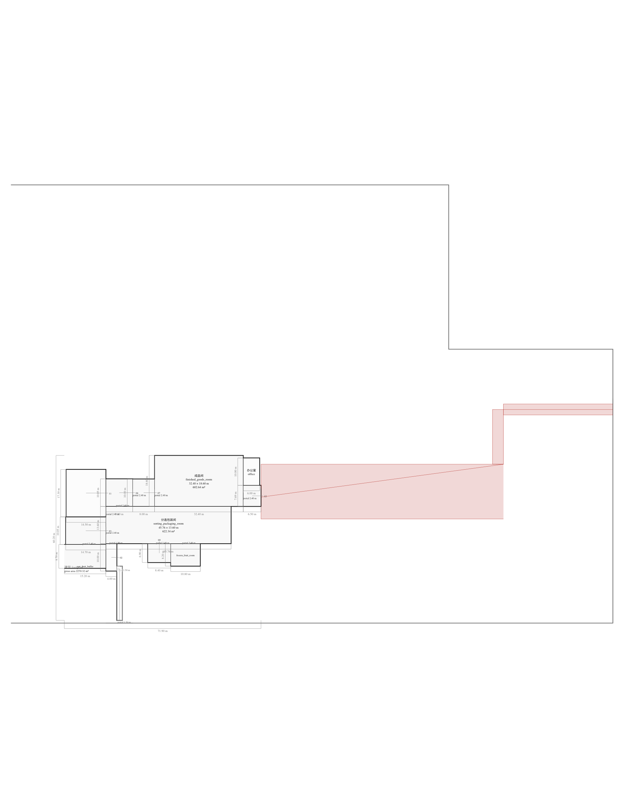

# V2.2.1 P1F — Cross-fixture drawing robustness

```ini
TASK_ID=V2_2_1_P1F_CROSS_FIXTURE_DRAWING_ROBUSTNESS_R1
BASE_MAIN_SHA=debda749966e7c890e2f8758f468fa582fb3def8
ACTIVE_GOVERNANCE_LANE=V2.2.1_P1F
P1F_AUTHORIZED=true
NEW_DRAWING_FEATURES_AUTHORIZED=false
ENGINEERING_ALGORITHM_CHANGED=false
VISUAL_STYLE_REDESIGN_AUTHORIZED=false
P1F_ACCEPTANCE_COMPLETE=false
P1F_BLOCKER=CONTEXT_INSET_MISSING_SHIPPING_LOADING_FACE_IN_PRESENTATION_AND_MOBILE_PREVIEW
```

## Scope and fixture inventory

This is an evaluation-only change. It reuses existing P2D/P3 tests and the
unmocked P4 Tool 7 scenario. No renderer or engineering source was changed.
The full-chain count below means an existing P2D-validated result was rendered
and linted in all four profiles; only the Tool 7 case exercises the P2C
validated-candidate selector.

| fixture_id | source | site aspect ratio | primary aspect ratio | irregular site | no-build | truck geometry | P2D full pass | P2C selector | full SVG usable |
| --- | --- | ---: | ---: | --- | --- | --- | --- | --- | --- |
| `P2D_REPRESENTATIVE_20T_RECTANGULAR_SITE` | Existing P2D representative fixture | 1.375 | 1.194352 | no | no | yes | yes | no | yes |
| `P3_EXISTING_CONCAVE_SITE_VALIDATED_LAYOUT` | Existing P3 concave-site test variation | 1.375 | 1.194352 | yes | no | yes | yes | no | yes |
| `P4_REAL_SELECTOR_SITE_WITH_NO_BUILD_ZONES` | Existing unmocked Tool 7 full-chain fixture | 1.372 | 1.442830 | no | yes, 3 polygons | yes | yes | yes | yes |
| `COMPOSITION_ONLY_WIDE_SITE_RIGHT_RAIL` | Synthetic bounds only | 4.000000 | 3.428571 | n/a | n/a | n/a | no | no | no |
| `COMPOSITION_ONLY_WIDE_PLAN_BOTTOM_RAIL` | Synthetic bounds only | 2.888889 | 2.923077 | n/a | n/a | n/a | no | no | no |

The synthetic cases contain only `geometry_bounds` and `primary_bounds`. They
are not project inputs, do not claim `PROJECT_LAYOUT_VALIDATED`, and produce
no room, access, truck, or SVG geometry. They exercise the existing finite
candidate order and its composition/page-furniture gates only.

## Full-chain profile acceptance matrix

Every authoritative fixture was replayed at least twice. Each SVG and lint
report was also projected/evaluated twice from the same validated inputs.
Every profile passed `drawing-lint@1.0.0` with zero errors, warnings, and
unavailable required facts. Collision and page-furniture overlap counts are
zero throughout.

| SCENARIO | SOURCE_TYPE | SITE_ASPECT_RATIO | PRIMARY_ASPECT_RATIO | PROFILE | SELECTED_COMPOSITION | DRAWING_LINT_GATE | ERRORS | WARNINGS | UNAVAILABLE_FACTS | ROOM_LABEL_COLLISIONS | PAGE_FURNITURE_OVERLAPS | MAIN_DRAWING_OCCUPANCY | PRIMARY_PLAN_OCCUPANCY | SVG_HASH | DETERMINISM | PROFILE_RESULT |
| --- | --- | ---: | ---: | --- | --- | --- | ---: | ---: | ---: | ---: | ---: | ---: | ---: | --- | --- | --- |
| P2D representative | P2D validated fixture | 1.375 | 1.194352 | PRESENTATION | n/a | PASS | 0 | 0 | 0 | 0 | 0 | 0.526630 | 0.754485 | `sha256:97e7c9083050dc1e1edd01c8880f4c7aa1d2526d72e8eff809ee792bda8cf59e` | PASS | BLOCKED_CONTEXT_INSET_INCOMPLETE |
| P2D representative | P2D validated fixture | 1.375 | 1.194352 | MOBILE_PREVIEW | n/a | PASS | 0 | 0 | 0 | 0 | 0 | 1.000000 | 1.000000 | `sha256:db6a39e7ad38ca8c0b0fc2063d4189bdd295691d92aaf7a922e59d7c200954c8` | PASS | BLOCKED_CONTEXT_INSET_INCOMPLETE |
| P2D representative | P2D validated fixture | 1.375 | 1.194352 | ENGINEERING_SHEET | RIGHT_RAIL | PASS | 0 | 0 | 0 | 0 | 0 | 0.700877 | 0.794318 | `sha256:96c82d7296d027a9b41b4b2d8198e7239bed61dbc0811259e0575e2ca3eb25d3` | PASS | PASS |
| P2D representative | P2D validated fixture | 1.375 | 1.194352 | ENGINEERING_REVIEW | n/a | PASS | 0 | 0 | 0 | 0 | 0 | 1.000000 | 0.142261 | `sha256:48ea97310b955b3e5b94ea68eebed49c377031c74cb4eeba9db003e36042f37d` | PASS | PASS |
| Existing concave site | P2D validated test variation | 1.375 | 1.194352 | PRESENTATION | n/a | PASS | 0 | 0 | 0 | 0 | 0 | 0.526630 | 0.754485 | `sha256:4732742c0a27a8c5e808dc4de8b6b8d1594e4e8130d692bbb8f259f44a2756b3` | PASS | BLOCKED_CONTEXT_INSET_INCOMPLETE |
| Existing concave site | P2D validated test variation | 1.375 | 1.194352 | MOBILE_PREVIEW | n/a | PASS | 0 | 0 | 0 | 0 | 0 | 1.000000 | 1.000000 | `sha256:aadc14f5fcb47fdcfbfce2e3cdface491172cfad2efacdf48dd406db98558d93` | PASS | BLOCKED_CONTEXT_INSET_INCOMPLETE |
| Existing concave site | P2D validated test variation | 1.375 | 1.194352 | ENGINEERING_SHEET | RIGHT_RAIL | PASS | 0 | 0 | 0 | 0 | 0 | 0.700877 | 0.794318 | `sha256:52739bc7163a7522783574dbc516c7312727aa37b3bcd7558b1ed3533ca45344` | PASS | PASS |
| Existing concave site | P2D validated test variation | 1.375 | 1.194352 | ENGINEERING_REVIEW | n/a | PASS | 0 | 0 | 0 | 0 | 0 | 1.000000 | 0.142261 | `sha256:5feff4442d0b11047bfd0eb74bb310876ebb9f58e11697107f0753b2e1d32fbc` | PASS | PASS |
| Tool 7 no-build site | Unmocked Tool 7 full chain | 1.372 | 1.442830 | PRESENTATION | n/a | PASS | 0 | 0 | 0 | 0 | 0 | 0.411693 | 0.762470 | `sha256:e731dbc092fb1758e4584c26d3c5d8caa11b18a567978555047ae035b7aff382` | PASS | BLOCKED_CONTEXT_INSET_INCOMPLETE |
| Tool 7 no-build site | Unmocked Tool 7 full chain | 1.372 | 1.442830 | MOBILE_PREVIEW | n/a | PASS | 0 | 0 | 0 | 0 | 0 | 1.000000 | 1.000000 | `sha256:1e29c2b517faba321139753ae01d475978c454d36fad0f9b5f2c32240d1a499f` | PASS | BLOCKED_CONTEXT_INSET_INCOMPLETE |
| Tool 7 no-build site | Unmocked Tool 7 full chain | 1.372 | 1.442830 | ENGINEERING_SHEET | RIGHT_RAIL | PASS | 0 | 0 | 0 | 0 | 0 | 0.709935 | 0.784193 | `sha256:6a222eb31572b812ed20cb76b796907a970807aff91f4ab9ae2b21beedc6c1bf` | PASS | PASS |
| Tool 7 no-build site | Unmocked Tool 7 full chain | 1.372 | 1.442830 | ENGINEERING_REVIEW | n/a | PASS | 0 | 0 | 0 | 0 | 0 | 1.000000 | 0.957143 | `sha256:3cad4c935733a653ce631cc2e1da0abf2147b02a4ffa9655d59e6ac58a3edd13` | PASS | PASS |

The Tool 7 test confirms the first P2C candidate fails P2D, a later candidate
passes, and the selected layout is projected without a mocked selector or
renderer. Both existing full-chain Engineering Sheet cases select `RIGHT_RAIL`.
The composition-only wide-plan case rejects `RIGHT_RAIL` on the frozen maximum
main-drawing occupancy and selects `BOTTOM_RAIL` on the next candidate. Its
main drawing occupancy is `0.7926479035`; all four occupancy floors, furniture
overlap, and furniture containment checks pass. This is not a validated SVG.

## Context-inset completeness blocker

The full-chain projections were also checked for the authoritative context
layers required by P1F. All three fixtures preserve the site boundary,
effective buildable boundary, building footprint, 12 zone footprints, and both
entrances in their focused context inset. The three `ENGINEERING_SHEET`
projections also include the selected shipping loading face in that inset.
However, the current `PRESENTATION` and `MOBILE_PREVIEW` insets omit the
context-mapped shipping loading face in all three fixtures. The selected
loading face remains drawn on the primary plan, but that does not satisfy the
separate context-inset requirement.

```ini
CONTEXT_INSET_BLOCKED_FIXTURE_COUNT=3
CONTEXT_INSET_BLOCKED_PROFILE_COUNT=6
CONTEXT_INSET_BLOCKER=CONTEXT_SHIPPING_LOADING_FACE_MISSING
PRESENTATION_LOADING_FACE_IN_CONTEXT_INSET=false
MOBILE_PREVIEW_LOADING_FACE_IN_CONTEXT_INSET=false
ENGINEERING_SHEET_LOADING_FACE_IN_CONTEXT_INSET=true
DRAWING_LINT_GATE=PASS
REPRESENTATIVE_SVG_HASHES_UNCHANGED=true
P1F_ACCEPTANCE_COMPLETE=false
```

This is an existing projection limitation, not a P1F code change. The
PRESENTATION/MOBILE visibility policy also keeps truck maneuver review
overlays hidden; P1F did not override that policy or invent another
circulation symbol. No renderer fix is authorized in this evaluation-only
stage. The blocker is recorded for Owner direction.

## Bounds-only composition checks

| Scenario | Candidate attempts in frozen order | selected | main occupancy | primary occupancy | furniture overlaps | furniture out of page | lint/SVG |
| --- | --- | --- | ---: | ---: | ---: | ---: | --- |
| `COMPOSITION_ONLY_WIDE_SITE_RIGHT_RAIL` | RIGHT_RAIL: pass | RIGHT_RAIL | 0.879121 | 0.868486 | 0 | 0 | not run; no drawing exists |
| `COMPOSITION_ONLY_WIDE_PLAN_BOTTOM_RAIL` | RIGHT_RAIL: reject (0.919213 > 0.88); BOTTOM_RAIL: pass | BOTTOM_RAIL | 0.792648 | 0.922606 | 0 | 0 | not run; no drawing exists |

## Representative exact-hash and P1D regression

The representative 20 t/day fixture retained the four hashes frozen by P1F:

```ini
PRESENTATION_SVG_HASH=sha256:97e7c9083050dc1e1edd01c8880f4c7aa1d2526d72e8eff809ee792bda8cf59e
MOBILE_PREVIEW_SVG_HASH=sha256:db6a39e7ad38ca8c0b0fc2063d4189bdd295691d92aaf7a922e59d7c200954c8
ENGINEERING_SHEET_SVG_HASH=sha256:96c82d7296d027a9b41b4b2d8198e7239bed61dbc0811259e0575e2ca3eb25d3
ENGINEERING_REVIEW_SVG_HASH=sha256:48ea97310b955b3e5b94ea68eebed49c377031c74cb4eeba9db003e36042f37d
REPRESENTATIVE_DRAWING_BYTES_CHANGED=false
P1D_REQUIRED_FACT_FAIL_CLOSED_REGRESSION=PASS
```

The P1E representative metrics are corrected in both the version plan and P1E
evidence document: primary-plan screen occupancy `0.7943176771550949`, width
ratio `0.8998748435544431`, and height ratio `0.8826979472140762`. The actual
primary bounds are `71.9 × 60.2 m`; these are not the drawing-bounds ratios.

## Visual evidence

The five selected PNGs are direct 1855×2400 MuPDF renders of the corresponding
unchanged SVG projection bytes. No crop, layout edit, post-processing, or
source-geometry change was applied. Evidence is rendered only from full-pass
authoritative scenarios; no picture is fabricated from bounds-only cases.

| Visual sample | PNG SHA-256 | SVG SHA-256 |
| --- | --- | --- |
| P2D representative — PRESENTATION | `d8b0f4c8042136a92fb65aefad490c2c84bfc7048894155c422dc9194199f958` | `sha256:97e7c9083050dc1e1edd01c8880f4c7aa1d2526d72e8eff809ee792bda8cf59e` |
| P2D representative — MOBILE_PREVIEW | `947de0a24a5e34b37f59ffe451339404cd534e626332572b24635184b2a3571d` | `sha256:db6a39e7ad38ca8c0b0fc2063d4189bdd295691d92aaf7a922e59d7c200954c8` |
| P2D representative — ENGINEERING_SHEET | `8158376e015a1c3af3d2a18250c43d83e5d2478a3b3904dc50442d986638fc73` | `sha256:96c82d7296d027a9b41b4b2d8198e7239bed61dbc0811259e0575e2ca3eb25d3` |
| Tool 7 no-build site — ENGINEERING_SHEET | `9e16953795abf62608d19d407b14d58b05433fc06bb4a8ad59589eb0cc6bcc57` | `sha256:6a222eb31572b812ed20cb76b796907a970807aff91f4ab9ae2b21beedc6c1bf` |
| Existing concave site — ENGINEERING_REVIEW | `a89f79c72f8d9e33c522b2d8087d8bbb88b8f0c4fe5c8f7b97d4f82106542a30` | `sha256:5feff4442d0b11047bfd0eb74bb310876ebb9f58e11697107f0753b2e1d32fbc` |

### Representative PRESENTATION



### Representative MOBILE_PREVIEW



### Representative ENGINEERING_SHEET — RIGHT_RAIL



### No-build-site ENGINEERING_SHEET — RIGHT_RAIL



### Concave-site ENGINEERING_REVIEW



Visual evidence is supplied for Owner review. The bounds-only BOTTOM_RAIL
case intentionally has no SVG/PNG because it has no authoritative room or
vehicle geometry. Automated Drawing Lint and these images do not replace Owner
visual review.

## Change boundary and governance

Only the evaluation harness, this evidence document, generated drawing
artifacts, and the two P1E evidence documents are changed. No production source,
engineering geometry, calculation authority, P2/P2D/P4, MCP, database, or
frontend is changed. Existing presentation whitespace and engineering-review
debug overlays are observed as their current profile behavior; P1F did not
redesign them. Automated drawing lint and page-layout checks have zero
blockers; the separate context-inset completeness issue is recorded above.
Owner visual review remains an independent gate.

```ini
RIGHT_RAIL_PATH_VALIDATED=true
BOTTOM_RAIL_PATH_VALIDATED=true
DRAWING_LINT_FAILED_SCENARIO_COUNT=0
DETERMINISM_FAILED_SCENARIO_COUNT=0
VISUAL_BLOCKER_SCENARIO_COUNT=3
VISUAL_BLOCKER_PROFILE_COUNT=6
P1F_ACCEPTANCE_COMPLETE=false
SOURCE_ENGINEERING_GEOMETRY_CHANGED=false
ENGINEERING_COORDINATES_MUTATED=false
P1G_AUTHORIZED=false
READY_AUTHORIZED=false
MERGE_AUTHORIZED=false
TAG_AUTHORIZED=false
RELEASE_AUTHORIZED=false
DEPLOYMENT_AUTHORIZED=false
NO_STEP_IMPLIES_THE_NEXT=true
```
