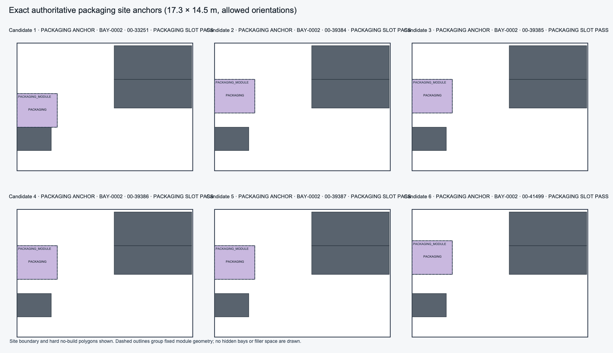
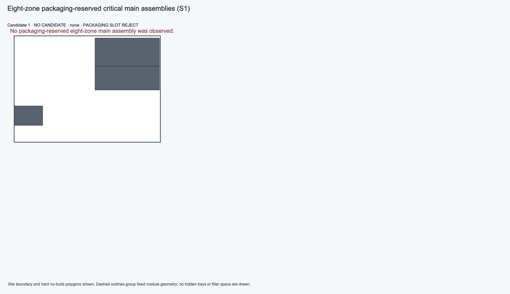
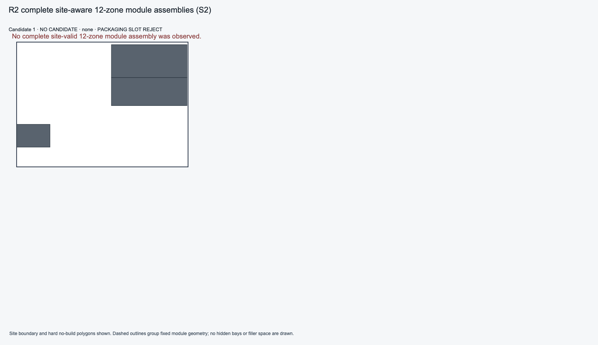

# V2.2.2 P1A R2: Critical Packaging-Anchor Joint Site-Assembly Recovery

**Task:** `V2_2_2_P1A_ENVELOPE_GRID_BAND_ZONE_GENERATOR_R2`
**Mode:** `R2_CRITICAL_PACKAGING_ANCHOR_JOINT_SITE_ASSEMBLY_RECOVERY`
**Baseline:** `49f634cdb76509cd2cd1d488b0da1f646f2b8071`
**Result:** `FAIL`

## Outcome

The structured generator now enumerates packaging anchors from the real
orthogonal buildable-site bays and evaluates main-process geometry jointly
against those anchors. Sorting roots are enumerated in both authority-allowed
orientations, and packaging-reservation failures do not consume the
tail-capable candidate limit. This did not produce a packaging-reserved main
assembly: the four distinct site-valid seven-zone geometries were all rejected
by the unchanged exact packaging-slot authority. The task therefore fails at
the required `PACKAGING_RESERVED_MAIN_COUNT > 0` gate; S2, truck, and structured
P2D were not reached.

## Exact replay evidence

Two unmocked Tool 7 replays used
`backend/tests/fixtures/v22/xinzhao_20t_site_layout_input_v3.json`. The exact
packaging authority remained 17.3 m × 14.5 m (250.85 m²), with the existing
allowed orientations and exact orthogonal event enumeration.

| Measure | Result |
| --- | ---: |
| Buildable bays | 13 |
| Legal packaging site anchors | 433 |
| Anchors by bay | BAY-0001: 216; BAY-0002: 201; BAY-0003: 16 |
| Sorting site attempts | 0°: 528; 90°: 960 |
| Distinct site-valid seven-zone geometries | 4 |
| Raw site-valid main attempts | 32 |
| Exact packaging-slot rejects | 4 |
| Packaging-reserved main assemblies | 0 |
| Site-valid structured 12-zone assemblies | 0 |
| Structured truck passes / P2D full passes | 0 / 0 |
| Placement node budget / visits | 120 / 120 |
| Structured / general-fallback nodes | 20 / 100 |
| Truck node budget | 5000 (unchanged) |

All 16 source-pair variants in each layout family were exhausted. LINEAR
produced the four distinct site-valid geometries and all four failed the exact
packaging slot proof. CENTRAL and SPINE produced no site-valid main geometry.
The formal R9 packaging preflight semantics were not changed; the early
construction preflight mismatch count was zero. The historical rejected
geometries remain in the prior evidence and were not overwritten.

The four current geometry hashes are `49506dbb…`, `7b3cdda6…`, `8905d1a4…`,
and `cb97b471…`; each has `PACKAGING_SLOT_EXISTS=false`. Across the 48
family/source-pair rows, both sorting orientations were attempted; the
LINEAR-family counters record 528 0° and 960 90° attempts. All 16 source pairs
per family were exhausted, with eight LINEAR source-pair rows marked
tail-capacity exhausted.

## Compatibility and determinism

The selected legacy control remains hard-valid with 12 zones, 12/12 access
requirements, validated truck route, and P2 complete. The two Tool 7 replays
selected the same layout, canonical result hash, SVG bytes, and structured
work/module trace. GENERAL_FALLBACK and P1F behavior were not modified.

The preserved R15 closure assertion still fails: only the control skeleton
has a distinct P2D full-pass result. It was not weakened or skipped. In the
targeted regression run, 137 tests passed and this one R15 assertion failed.

## Images and machine evidence

Machine-generated evidence is stored at
`docs/tasks/evidence/v2_2_2_p1a/xinzhao_p1a_r2_critical_packaging_anchor_joint_site_assembly.json`.
The anchor image displays legal packaging anchors; the reserved-main and
12-zone images explicitly show that no candidate was admitted. The P2D gallery
is empty of structured full-pass candidates.

## Validation and governance

- R2/R9 unit tests: 36 passed.
- Targeted R2/R9/R11/R13/R15/P1F/P2C/P2D/P4 run: 137 passed, 1 failed; the
  sole failure is the preserved R15 distinct-full-pass count assertion.
- Full architecture suite: 777 passed, 16 skipped. The first invocation had
  one environment-only failure because a nested test subprocess resolved the
  system Python without pytest; rerunning with the project virtualenv first on
  `PATH` passed the complete suite.
- Changed-file Ruff and format checks: passed; Mypy passed for 396 source
  files. A whole `ruff check src tests` invocation also reported existing
  issues in unrelated `tests/pilot/` files, which were not modified.
- Two real Tool 7 replays: deterministic; legacy control hard-valid.
- Protected `site_geometry.py` diff: empty.
- Exact-head PR/push CI: pending the authorized forward-only commit and push.

PR #302 remains Draft. No R3 is started, and no readiness, merge, tag, release,
or deployment action is taken.
