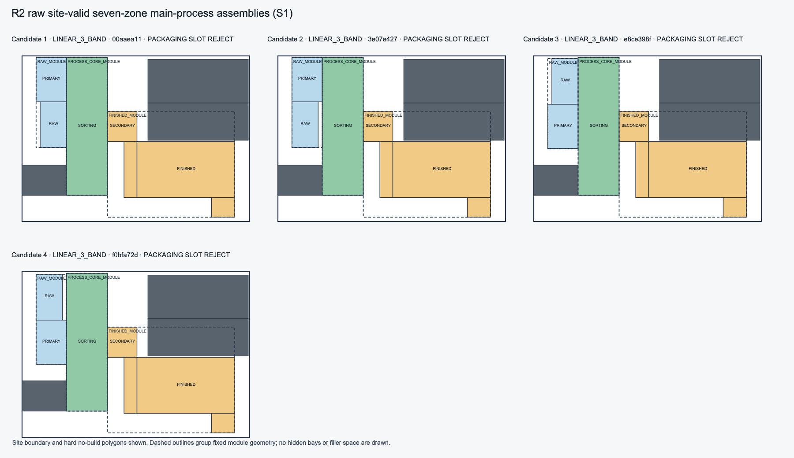
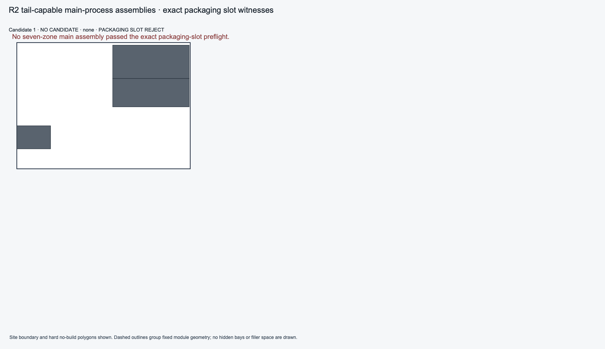

# V2.2.2 P1A R2: Tail-Capacity-Aware Site Module Assembly Recovery

**Task:** `V2_2_2_P1A_ENVELOPE_GRID_BAND_ZONE_GENERATOR_R2`
**Mode:** `R2_TAIL_CAPACITY_AWARE_SITE_MODULE_ASSEMBLY_RECOVERY`
**Baseline:** `55710bcd45d92eca74fd2681122da94849218f6f`
**Result:** `FAIL`

## Outcome

The S1 candidate limit now applies to main-process geometries that pass the
existing exact packaging-slot preflight. A site-valid geometry rejected by
that preflight is recorded and does not consume the tail-capable limit; source
pair enumeration continues. The formal packaging admission remains in place
after canonical skeleton construction and uses the same R9 evaluator.

The real Xinzhao replay still found no tail-capable S1. It evaluated four
distinct site-valid seven-zone geometries, all in `LINEAR_3_BAND`; the exact
orthogonal event enumeration rejected all four. The previously reported
`cb97b471…` and `8905d1a4…` geometries remain in the rejected evidence, alongside
two additional distinct geometries. CENTRAL and SPINE produced no site-valid
main geometry. S2, truck, and structured P2D were therefore not entered. This
is a genuine `FAIL` at the task's S1+ gate, not evidence that the packaging
preflight should be relaxed.

The four unique main geometries appeared in 32 source-pair/lane attempt rows.
The exact proof was computed four times and reused 28 times by geometry
signature. All 16 source-pair rows for each family were exhausted; eight
LINEAR source-pair rows were specifically classified as tail-capacity
exhausted. Early/formal mismatch count was zero; no tail-capable candidate was
available for a non-vacuous formal comparison in this replay.

## Preserved authority and compatibility

- Packaging dimensions, event completeness, obstacles, and exact orthogonal
  preflight semantics are unchanged.
- The early filter is construction pruning only. The formal R9 admission call
  remains after `MainProcessSkeletonCandidateV1` creation.
- Placement budget remains 120; truck-node budget remains 5000. Packaging
  preflight compute is not charged as a placement node.
- GENERAL_FALLBACK, legacy enumeration, P1F routing, and candidate selection
  authority were not changed.
- The selected legacy control remains hard-valid: 12 zones, access 12/12,
  truck route validated, and P2 complete.
- Historical R2 evidence, including the two earlier rejected skeletons, was
  not rewritten.

## Real Tool 7 evidence

Two unmocked replays used
`backend/tests/fixtures/v22/xinzhao_20t_site_layout_input_v3.json`. They
produced the same selected control, canonical result hash, SVG bytes, and
module/work-queue trace. Current S1 evidence is machine-generated at
`docs/tasks/evidence/v2_2_2_p1a/xinzhao_p1a_r2_tail_capacity_aware_site_module_assembly.json`.

The tail-capable candidate image shows the real site and no-build polygons and
contains no candidate because no main geometry passed the exact preflight. The
separate raw-site-valid image retains all four geometries that reached the
preflight and labels each exact rejection:

## Validation

- R2 local-composition/S1 unit tests: 27 passed.
- Targeted R2/R9/R11/R13/R15/P1F/P2C/P2D/P4 regression selection: 144 passed.
- Architecture suite: 777 passed, 16 skipped.
- Mypy: passed for 396 backend source files.
- Ruff and format checks: passed for changed source/tests/evaluation files.
- Real Xinzhao Tool 7: two unmocked replays, deterministic; fallback control
  hard-valid.
- P1F cross-fixture evaluation: 3 passed.
- R9 cross-fixture Tool 7 regression: 2 passed.
- Ruff check and format check across the backend: passed; `git diff --check`
  passed. The protected `site_geometry.py` diff check is clean.
- Exact-head CI is pending after the authorized forward-only commit/push.

PR #302 remains Draft. The preserved R15 distinct-full-pass assertion is not
modified; since no new structured full-pass candidate was generated here, its
historical blocker remains.
