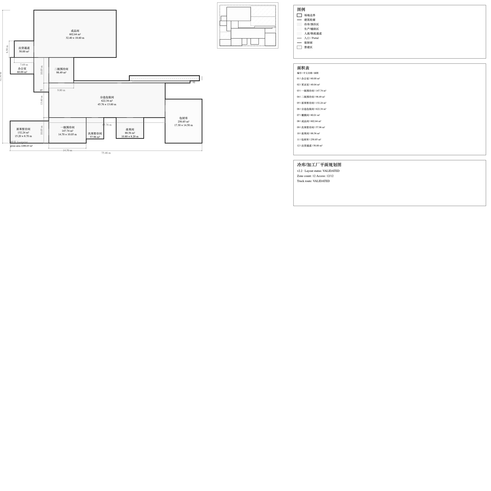
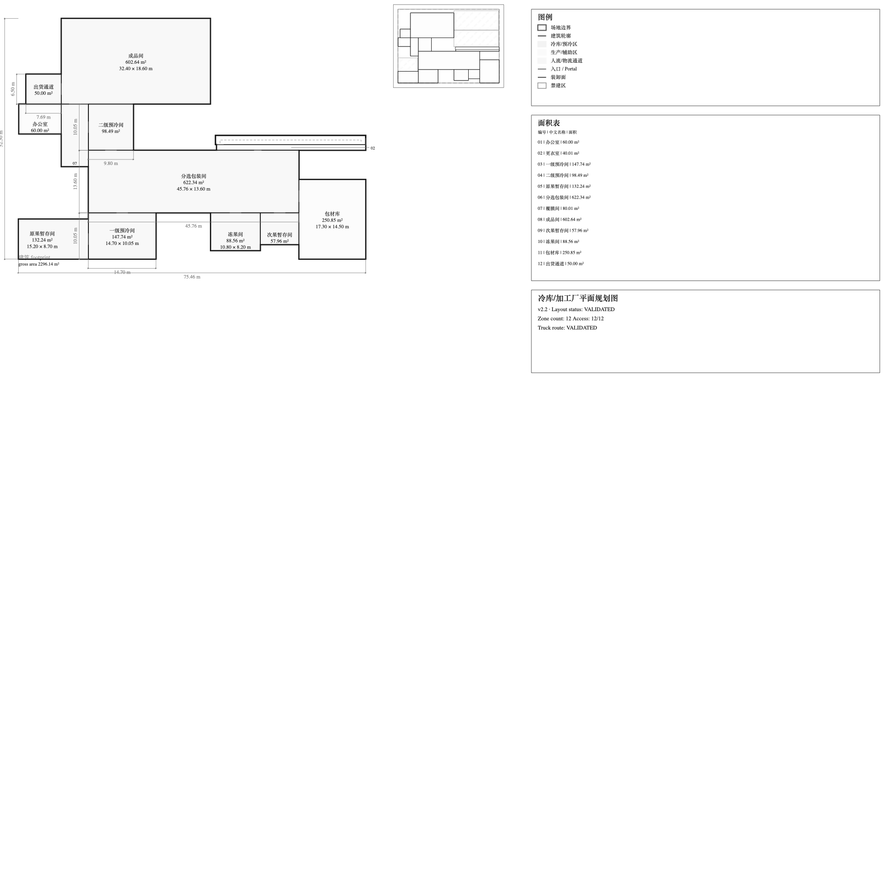

# Xinzhao P1A before/after evidence

The before image is the v2.2.1 Owner-fail layout. The after image is the
current P1A unmocked Tool 7 output, rendered twice in the evaluation test with
byte-identical selected layout/SVG hashes. Both SVGs are direct projection
outputs; PNGs are direct Quick Look SVG raster renders and were not edited.

| Evidence | Structured layout | SVG | PNG |
| --- | --- | --- | --- |
| v2.2.1 baseline | [JSON](xinzhao_v221_before_layout.json) | [SVG](xinzhao_v221_before.svg) |  |
| P1A | [JSON](xinzhao_p1a_after_layout.json) | [SVG](xinzhao_p1a_after.svg) |  |

```ini
V221_CANONICAL_RESULT_HASH=sha256:eaa791651fa3fdb20d707d18fa31620992ab17b1ade8dc89554b8b2331742b30
P1A_CANONICAL_RESULT_HASH=sha256:9f64e0ce861495231e47c6c8116277521029603fa33e3074c15559dd4d4fb57e
V221_SVG_SHA256=sha256:db63fa7a6954820dd21dc0a7c70aba6f2cbfa7de6c5d2299027176100b109973
P1A_SVG_SHA256=sha256:7f24aabd674218c097ce71d229d7bd57d9d774ab47f3ec612fded749abf2779f
V221_SUPPORT_GROUP_SHARED_EDGES=0
P1A_SUPPORT_GROUP_SHARED_EDGES=2
V221_PROCESS_CORE_DIRECT_EDGES=2/2
P1A_PROCESS_CORE_DIRECT_EDGES=2/2
V221_MAJOR_ZONE_GRID_ALIGNMENT_RATE=0.4
P1A_MAJOR_ZONE_GRID_ALIGNMENT_RATE=0.4
OWNER_XINZHAO_P1A_VISUAL_REVIEW=PENDING
```

The visual artifact is for Owner review, not engineering authority. P1A does
not claim a calibrated regularity threshold or global search optimum.
