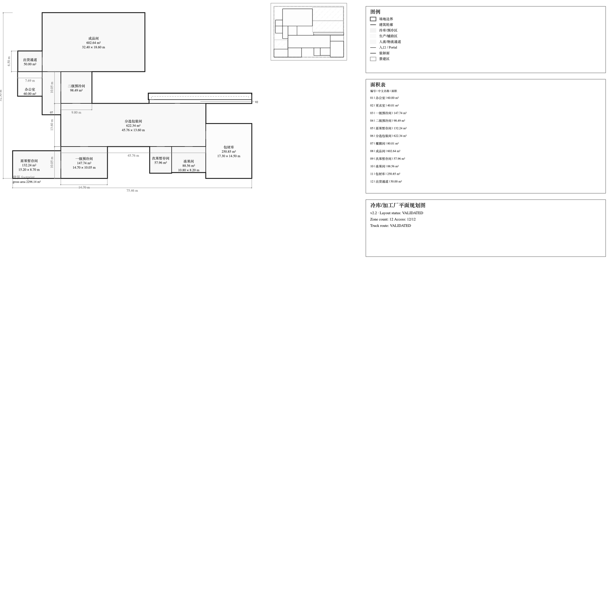

# Xinzhao P1A R2 — same-canvas visual comparison

All three source SVGs have the same `viewBox="0 0 1931.62 830"`. The PNGs
are direct, uncropped Quick Look renders at 1800 × 1800 pixels. No SVG or
image was manually edited. This is a visual evidence pack, not engineering
authority.

| v2.2.1 Owner-fail baseline | P1A R1 Owner-fail | P1A R2 current |
| --- | --- | --- |
|  |  |  |
| [SVG](xinzhao_v221_before.svg) · [layout JSON](xinzhao_v221_before_layout.json) | [SVG](xinzhao_p1a_after.svg) · [layout JSON](xinzhao_p1a_after_layout.json) | [SVG](xinzhao_p1a_r2_after.svg) · [layout JSON](xinzhao_p1a_r2_after_layout.json) |

## Measured result and limitation

The selected R2 main-process rectangles (`raw_fruit_buffer`,
`primary_precooling_room`, `sorting_packaging_room`,
`secondary_precooling_room`, `coating_room`, `finished_goods_room`, and
`shipping_channel`) are coordinate-identical to both the v2.2.1 baseline and
R1. R2 changes support/personnel positions, raises support-group shared edges
from 0 to 2, and produces new result/SVG hashes, but does **not** demonstrate
a changed primary production skeleton. Major-zone grid alignment remains 0.4;
the support attachment still touches three sides of the sorting core. The
current visual change is therefore insufficient evidence that the original
layout-regularity blocker is solved.

The selector explores all three deterministic family lanes. At the selected
120-node budget it finds two P2D full-pass candidates, both from
`CENTRAL_PROCESS_HUB`; the two linear lanes have no complete P2C candidate
within their bounded search and are not proven infeasible. The two full-pass
candidates have identical structural comparison facts, so the first decisive
tie-break is the existing P2B2 comparator. See
[budget sensitivity evidence](xinzhao_p1a_r2_budget_sensitivity.json).

```ini
OWNER_XINZHAO_P1A_R1_VISUAL_REVIEW=FAIL
OWNER_XINZHAO_P1A_R2_VISUAL_REVIEW=PENDING
R2_MAIN_PROCESS_GEOMETRY_CHANGED=false
R2_PRIMARY_PLAN_LAYOUT_EFFECT=INSUFFICIENT
P2D_FULL_PASS_CANDIDATE_COUNT=2
DISTINCT_FULL_PASS_FAMILY_COUNT=1
FIRST_DECISIVE_COMPONENT=P2B2_FINAL_TIE_BREAK
MAJOR_ZONE_GRID_ALIGNMENT_RATE=0.4
STRUCTURAL_SUPPORT_GROUP_SHARED_EDGES=2
SUPPORT_ATTACHMENT_SIDE_COUNT=3
GLOBAL_OPTIMUM_CLAIMED=false
```

```ini
V221_CANONICAL_RESULT_HASH=sha256:eaa791651fa3fdb20d707d18fa31620992ab17b1ade8dc89554b8b2331742b30
R1_CANONICAL_RESULT_HASH=sha256:9f64e0ce861495231e47c6c8116277521029603fa33e3074c15559dd4d4fb57e
R2_CANONICAL_RESULT_HASH=sha256:24053026755a654234f476c566cf9398cbabbafcbc09d9f122597f504ad0162f
V221_SVG_SHA256=sha256:db63fa7a6954820dd21dc0a7c70aba6f2cbfa7de6c5d2299027176100b109973
R1_SVG_SHA256=sha256:7f24aabd674218c097ce71d229d7bd57d9d774ab47f3ec612fded749abf2779f
R2_SVG_SHA256=sha256:342775cb44d7165a9a64ad7e7f31cd287c04d5a1655bcc8f31ec1c1224f85981
```
