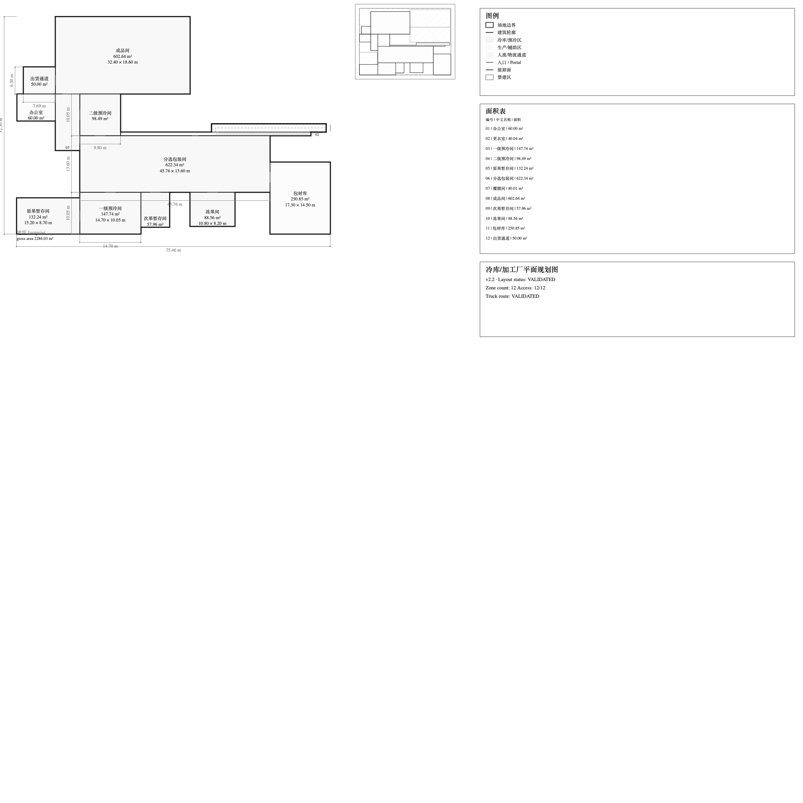
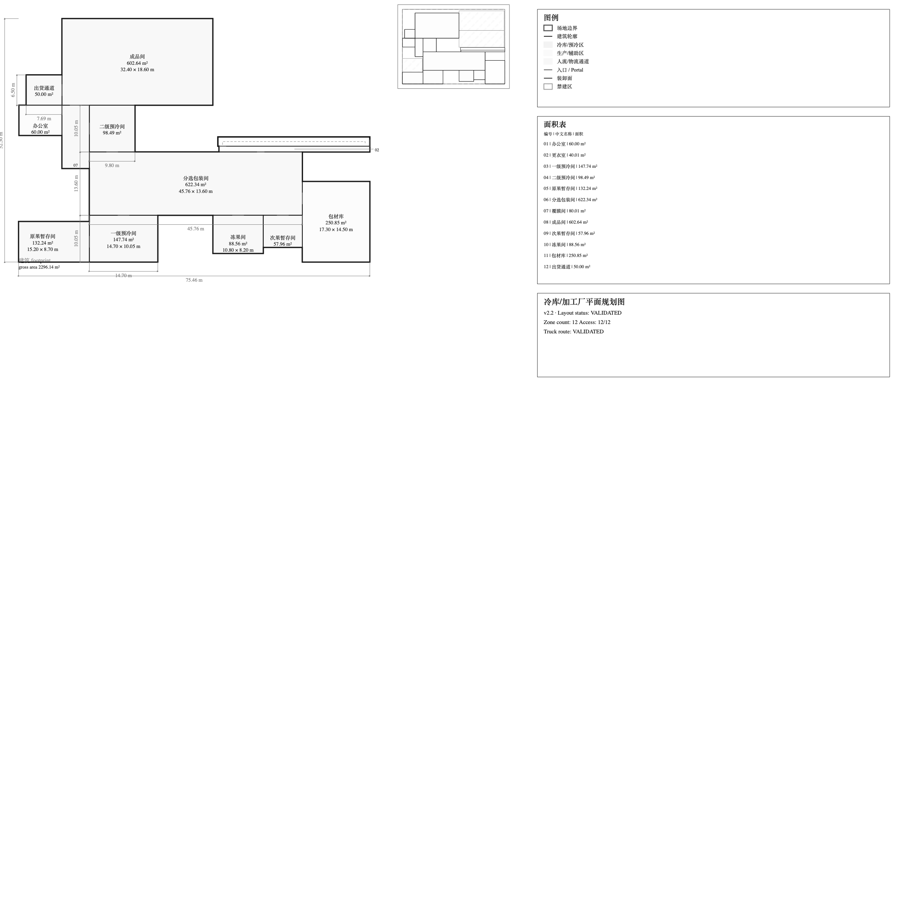
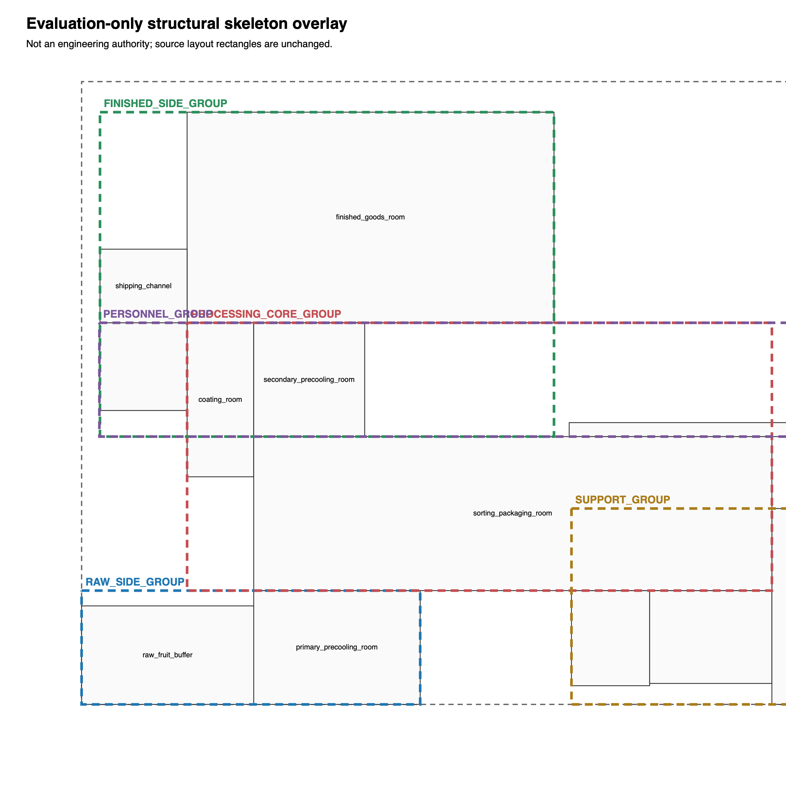

# Xinzhao P1A R3 — four-way visual/evidence comparison

All four source SVGs use the same `viewBox="0 0 1931.62 830"`. Each PNG is a
direct, uncropped macOS Quick Look raster of its named SVG at 2400 × 2400 px;
no SVG or image was manually edited. These are comparison artifacts, not
engineering authority.

| v2.2.1 Owner-fail baseline | P1A R1 | P1A R2 | P1A R3 |
| --- | --- | --- | --- |
|  |  |  |  |
| [SVG](xinzhao_v221_before.svg) · [layout JSON](xinzhao_v221_before_layout.json) | [SVG](xinzhao_p1a_after.svg) · [layout JSON](xinzhao_p1a_after_layout.json) | [SVG](xinzhao_p1a_r2_after.svg) · [layout JSON](xinzhao_p1a_r2_after_layout.json) | [SVG](xinzhao_p1a_r3_after.svg) · [layout JSON](xinzhao_p1a_r3_after_layout.json) |

## R3 outcome

The R3 output remains engineering-hard-valid and deterministic, but it does
not change any of the seven main-process rectangles from v2.2.1/R1/R2. Its
SVG bytes/hash are also equal to R2. Two full-pass candidates exist, but they
contain only one distinct full-pass main-process skeleton; the existing P2B2
tie-break is the first decisive component. Accordingly, the actual result is
`PARTIAL`, not visual acceptance.

The overlay below is evaluation-only. It exposes the selected layout's
current group envelopes and dominant axis; it is not a production drawing or
an engineering authority.



```ini
OWNER_XINZHAO_P1A_R2_VISUAL_REVIEW=FAIL
OWNER_XINZHAO_P1A_R3_VISUAL_REVIEW=PENDING
R3_MAIN_PROCESS_GEOMETRY_CHANGED=false
R3_MAIN_PROCESS_CHANGED_ZONE_COUNT=0
P2D_FULL_PASS_CANDIDATE_COUNT=2
DISTINCT_FULL_PASS_MAIN_SKELETON_COUNT=1
RUNNER_UP_PRESENT=true
FIRST_DECISIVE_COMPONENT=P2B2_FINAL_TIE_BREAK
R3_SELECTED_FAMILY=CENTRAL_PROCESS_HUB
R3_NODE_BUDGET=120
R3_SEARCH_GLOBAL_OPTIMUM_CLAIMED=false
R3_CANONICAL_RESULT_HASH=sha256:b3dd2de4fb24f74b5ce96601a74edab5f58a9a781eb5af41b29afd0a66ac98da
R3_SVG_SHA256=sha256:342775cb44d7165a9a64ad7e7f31cd287c04d5a1655bcc8f31ec1c1224f85981
R3_SVG_HASH_EQUALS_R2=true
PROJECT_LAYOUT_VALIDATED=true
P2_COMPLETE=true
ACCESS_PASS_COUNT=12
ACCESS_REQUIREMENT_COUNT=12
TRUCK_ROUTE_VALIDATED=true
```

Raster SHA-256 values and search traces are recorded in
[R3 metrics](xinzhao_p1a_r3_metrics.json),
[budget sensitivity](xinzhao_p1a_r3_budget_sensitivity.json), and
[skeleton search evidence](xinzhao_p1a_r3_skeleton_search.json).
